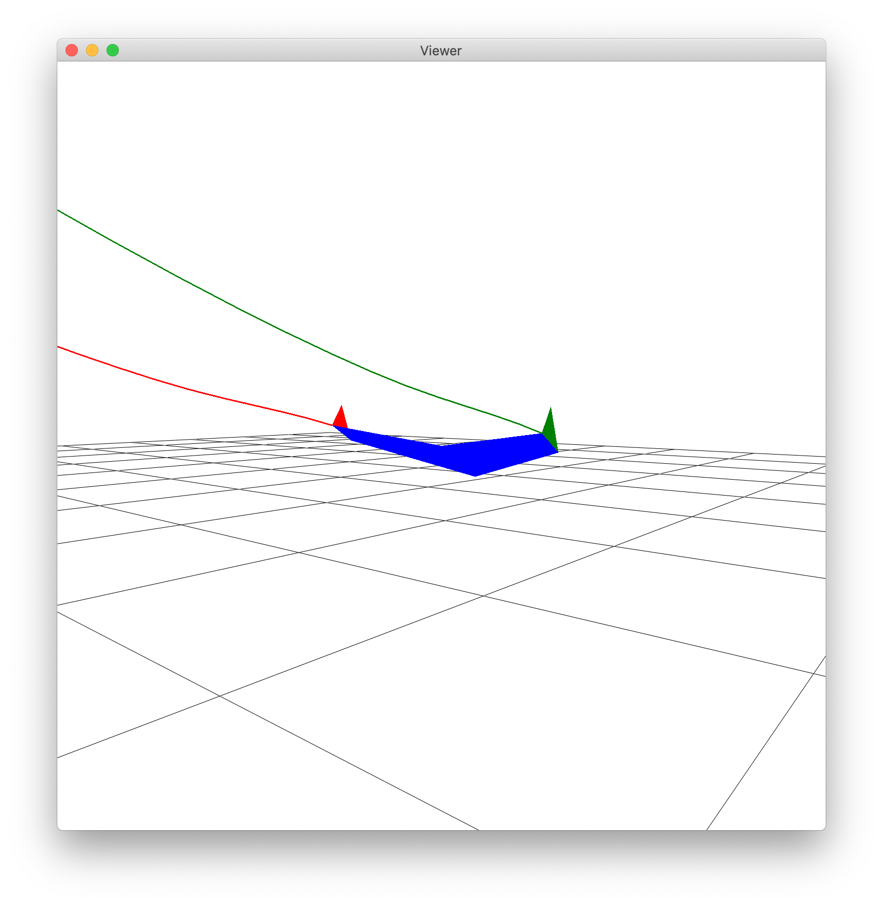
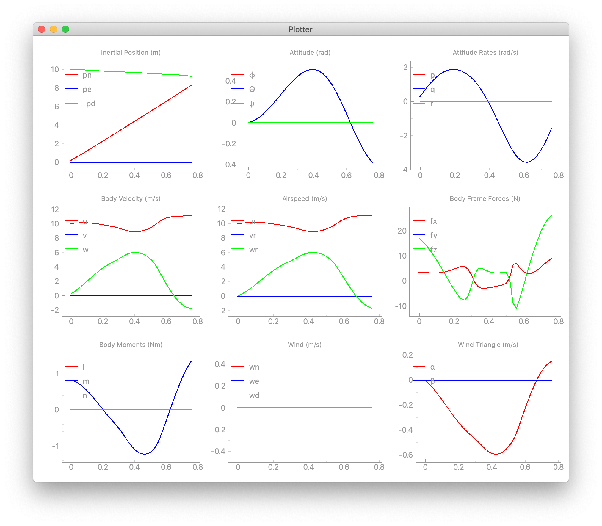

# UAV Control

An ongoing project to develop a control system for a small fixed wing model aircraft, specifcally the [FT Versa Wing Pusher](https://www.flitetest.com/articles/ft-versa-wing-build), primarily using ["Small Unmanned Aircraft: Theory and Practice"](https://uavbook.byu.edu/doku.php) by R. Beard & T. McClain

Current Project State: Finalizing aircraft simulator.





### Running the simulator:

```bash
python main.py [-h] [--sim SIM] [--simtime SIMTIME] [-noview] [-noplot] [-nogui] [-aar]
```

Options:

`-h` Show the help screen

`--sim SIM` Load the simulation file

`--simtime SIMTIME` Override the simulation file time

`-noview` Disable the viewer window

`-noplot` Disable the data plot window

`-nogui` Disable both windows during the simulation run

`-aar` Open the data plot window after the simulation has run

